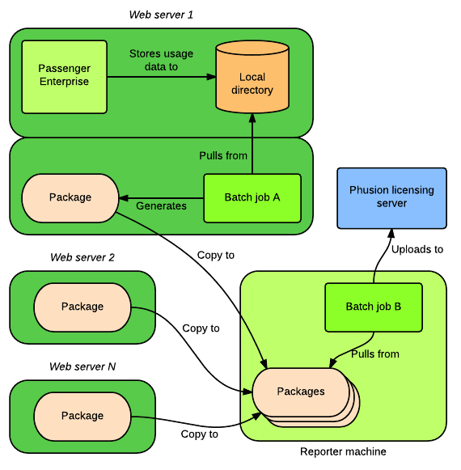

# Phusion Passenger Enterprise cloud licensing configuration

When using the [Phusion Passenger Enterprise](https://www.phusionpassenger.com/enterprise) cloud license, you are billed per server per hour. There is a mechanism which automatically reports usage to the Phusion licensing server. This is implemented by sending a certain HTTPS request to the Phusion Passenger website, https://www.phusionpassenger.com, every 15 minutes, on every server that Phusion Passenger Enterprise is running with a cloud license.

Sometimes, this manner of reporting usage data is not desirable, e.g. because of organizational security policies. For example, the servers that run Phusion Passenger Enterprise might block all outgoing traffic, or the network intrusion detection system might flag the usage reports as suspicious. To address these concerns, Phusion Passenger Enterprise 4.0.54 and later provide the ability to report usage through periodic batch jobs.

## Conceptual overview

The setup works as follows:

 1. Phusion Passenger Enterprise stores usage data on the local disk, but does not send them to the Phusion licensing server.
 2. On each server that runs Phusion Passenger Enterprise, a batch job A generates a package from the usage data that's stored on disk.
 3. All these packages are copied to another machine (let's call this "Reporter"), e.g. through SCP, USB stick, etc. The reporter machine may be any machine that you choose, as long as it can access the Phusion licensing server. The method of copying does not matter.
 4. On the reporter machine, a batch job B uploads all these packages to the Phusion licensing server.

## Phase 1: setting up web servers

Follow these instructions on each server running Phusion Passenger Enterprise with a cloud license.

 1. Login to the web server and open a superuser shell. For example:

        bash$ sudo -H bash

    Or, if you're an RVM user, use rvmsudo instead of sudo:

        bash$ rvmsudo -H bash

 2. Add the following configuration to your Apache or Nginx configuration file:

        # Apache
        PassengerCtl licensing_data_points_auto_send false

        # Nginx
        passenger_ctl licensing_data_points_auto_send false;

    Then restart Apache/Nginx. This configuration tells Phusion Passenger Enterprise not to automatically send usage data to the Phusion licensing server.

 3. Find out what user the PassengerHelperAgent process is running as.

    First, look for the PID of the PassengerHelperAgent process.

        bash# passenger-memory-stats
        ...
        ------ Passenger processes ------
        PID    VMSize     Resident  Name
        ---------------------------------
        11243  2405.8 MB  2.7 MB    PassengerHelperAgent
        ...

    Then use `ps` to determine what user it's running as. Usually, it's running as root.

        bash# ps -o pid,user -p 11243
          PID USER
        11245 root

 4. Create a directory in which to store usage data packages. For example:

        bash# mkdir /var/lib/passenger-enterprise-usage

    Ensure that it's owned by the user that PassengerHelperAgent runs as, and make it owner-accessible only:

        bash# chown root: /var/lib/passenger-enterprise-usage
        bash# chmod 700 /var/lib/passenger-enterprise-usage

 5. Create a script inside the previous directory for generating a usage data package, and for copying packages to the reporter machine. This script is part of batch job A.

        bash# touch /var/lib/passenger-enterprise-usage/script
        bash# chmod +x /var/lib/passenger-enterprise-usage/script
        bash# editor /var/lib/passenger-enterprise-usage/script

    The script should contain:

        #!/bin/bash
        set -e

        REPORTER_MACHINE=foo@reporter-machine-host-name
        HOSTNAME=`hostname`
        DATE=`date +%s`

        set -x
        passenger-config package-cloud-usage /var/lib/passenger-enterprise-usage/$HOSTNAME-$DATE.tar.gz
        scp /var/lib/passenger-enterprise-usage/*.tar.gz $REPORTER_MACHINE:passenger-enterprise-usage/
        rm -f /var/lib/passenger-enterprise-usage/*.tar.gz

    Here, `foo@reporter-machine-host-name` specifies which reporter machine you want to copy the package to, and which username you want to use to login to the reporter machine. Replace this with an appropriate value.

    **Notes about SSH keys**: don't forget to setup SSH keys so that the script can scp to the reporter machine. The script will be run as the user that PassengerHelperAgent is running as.

    **Notes about PATH**: the above script assumes that the `passenger-config` command is in PATH. This is always the case if you installed Passenger Enterprise using Debian or RPM packages, but may not be the case if you installed it using RubyGems or tarball. If it's not in PATH, or when in doubt, you should specify the full path to passenger-config. You can find out where passenger-config is using `which`. For example:

        bash# which passenger-config
        /opt/passenger-enterprise-x.x.x/bin/passenger-config

    Then the script should call:

        /opt/passenger-enterprise-x.x.x/bin/passenger-config package-cloud-usage ...

 6. Open the crontab of the user that PassengerHelperAgent is running as. For example, if PassengerHelperAgent is running as root:

        bash# sudo -u root -H crontab -e

 7. Insert the following entry into the crontab, so that the script is invoked on the 1st of every month:

        0 0 1 * * /var/lib/passenger-enterprise-usage/script

 8. Ensure that `/var/lib/passenger-enterprise-usage/script` is run during system shutdown, as the user that PassengerHelperAgent is running as. On most Linux systems, this can be achieved by as follows:

        bash# touch /etc/init.d/passenger-enterprise-cloud-license
        bash# chmod +x /etc/init.d/passenger-enterprise-cloud-license
        bash# ln -s /etc/init.d/passenger-enterprise-cloud-license /etc/rc0.d/K00passenger-enterprise-cloud-license
        bash# ln -s /etc/init.d/passenger-enterprise-cloud-license /etc/rc6.d/K00passenger-enterprise-cloud-license
        bash# editor /etc/init.d/passenger-enterprise-cloud-license

    If PassengerHelperAgent is running as root, then `/etc/init.d/passenger-enterprise-cloud-license` should contain:

        #!/bin/bash
        set -e
        exec /var/lib/passenger-enterprise-usage/script

    If PassengerHelperAgent is not running as root, then it should contain:

        #!/bin/bash
        set -e
        exec sudo -u PROPER_USERNAME_HERE -H /var/lib/passenger-enterprise-usage/script

    Or, if you're an RVM user, use rvmsudo instead of sudo:

        #!/bin/bash
        set -e
        exec rvmsudo -u PROPER_USERNAME_HERE -H /var/lib/passenger-enterprise-usage/script

    **Note:** If your operating system does not respect /etc/rcX.d, please consult your operating system's manual to learn how to run `/var/lib/passenger-enterprise-usage/script` during system shutdown.

## Phase 2: setting up the "reporter" machine

In phase 1, you've setup web servers to scp usage data packages to the reporter machine, by logging into the reporter machine as a certain user. Let's call that user "foo".

 1. Login to the reporter machine as user foo.

 2. Create a directory that the web servers can scp into:

        bash$ mkdir ~/passenger-enterprise-usage
        bash$ chmod 700 ~/passenger-enterprise-usage

 3. Install the [passenger-enterprise-bulk-send-cloud-usage](https://github.com/phusion/passenger-enterprise-bulk-send-cloud-usage) tool:

        bash$ cd ~
        bash$ curl -L -O https://github.com/phusion/passenger-enterprise-bulk-send-cloud-usage/archive/master.tar.gz
        bash$ tar xzvf master.tar.gz && rm master.tar.gz

 4. Open the crontab of user foo:

        bash$ crontab -e

 5. Insert the following entry into the crontab to upload usage data packages on the 1st of every month:

        0 1 1 * * ~/passenger-enterprise-bulk-send-cloud-usage/passenger-enterprise-bulk-send-cloud-usage --delete ~/passenger-enterprise-usage-*.tar.gz

    This crontab entry is batch job B as described in the conceptual overview.

    Note that this command is run at 1 AM: 1 hour after the web servers have generated usage data packages and copied them over to the reporter machine. You *must* therefore ensure that the clocks on the web servers and the reporter machine are properly synchronized, and that they are set to the same time zone.

## Phase 3: testing

Once the web servers and the reporter machine are all setup, you can test whether the setup works correctly.

 1. On each web server, run `/var/lib/passenger-enterprise-usage/script` as the user that PassengerHelperAgent runs as. For example, if PassengerHelperAgent is running as root:

        sudo -u root -H /var/lib/passenger-enterprise-usage/script

    Or, if you're an RVM user, use rvmsudo instead of sudo:

        rvmsudo -u root -H /var/lib/passenger-enterprise-usage/script

    You should see output like this:

        + passenger-config package-cloud-usage /var/lib/passenger-enterprise-usage/myhostname-1415377926.tar.gz
        + scp /var/lib/passenger-enterprise-usage/myhostname-1415377310.tar.gz hongli@localhost:passenger-enterprise-usage/
        myhostname-1415377310.tar.gz                     100%  605     0.6KB/s   00:00
        + rm -f /var/lib/passenger-enterprise-usage/myhostname-1415377310.tar.gz

 2. Login to the reporter machine as the "foo" user (as described in phase 2) and run:

        ~/passenger-enterprise-bulk-send-cloud-usage-master/passenger-enterprise-bulk-send-cloud-usage --delete ~/passenger-enterprise-usage/*.tar.gz

    You should see output like this:

        ---- Uploading ~/passenger-enterprise-usage/myhostname-1415377310.tar.gz -----
        Success!
        Deleting ~/passenger-enterprise-usage/myhostname-1415377310.tar.gz

 3. Login to the [Phusion Passenger Enterprise Customer Area](https://www.phusionpassenger.com/orders). Under "Cloud subscription status", click "View usage details". Verify that usage has been properly registered.
